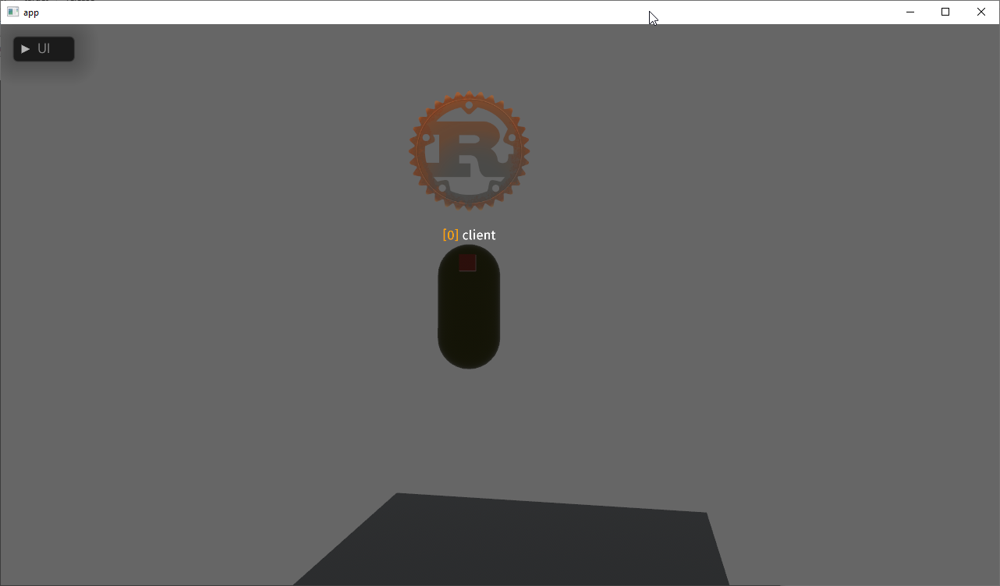

# bevy_mod_billboard
Billboard text and texture support for bevy



## Todo
- Follow Rust API Guidelines: https://rust-lang.github.io/api-guidelines/about.html

## Limitations

- Uses texture_array for text, according to
[this](https://github.com/gfx-rs/wgpu/issues/3197), it doesn't work on
webgl2.

## Bevy Compatibility

| Bevy Version | Crate Version |
|--------------|---------------|
| `0.10`       | `0.2.1`       |
| `0.9`        | `0.1.1`       |

## Example

Setup:
```rs
App::new()
    .add_plugins(DefaultPlugins)
    .add_plugin(BillboardPlugin);
```

Text:
```rs
commands.spawn(BillboardTextBundle {
    transform: Transform::from_translation(Vec3::new(0., 2., 0.))
        .with_scale(Vec3::splat(0.0085)),
    text: Text::from_sections([
        TextSection {
            value: "IMPORTANT".to_string(),
            style: TextStyle {
                font_size: 60.0,
                font: fira_sans_regular_handle.clone(),
                color: Color::ORANGE,
            }
        },
        TextSection {
            value: " text".to_string(),
            style: TextStyle {
                font_size: 60.0,
                font: fira_sans_regular_handle.clone(),
                color: Color::WHITE,
            }
        }
    ]).with_alignment(TextAlignment::CENTER),
    ..default()
});
```

Texture:
```rs
fn spawn_billboard_texture(
    mut billboard_textures: ResMut<Assets<BillboardTexture>>,
    // rest
) {
    commands.spawn(BillboardTextureBundle {
        transform: Transform::from_translation(Vec3::new(0., 5., 0.)),
        texture: billboard_textures.add(BillboardTexture::Single(image_handle.clone()),
        mesh: meshes.add(Quad::new(Vec2::new(4.0, 4.0)).into()).into(),
        ..default()
    });
}
```

Full examples at [examples](examples).

## Changelog

## [0.2.1] - 2023-03-29
- Fix memory leak caused by ImageBindGroup

### [0.2.0] - 2023-03-19
- Upgrade to Bevy 0.10.0
- Remove BillboardTextSize, it isn't needed for internal calculations anymore

Full changelog at [CHANGELOG.md](CHANGELOG.md).

## License

Licensed under either of

* Apache License, Version 2.0
([LICENSE-APACHE](LICENSE-APACHE) or http://www.apache.org/licenses/LICENSE-2.0)
* MIT license
([LICENSE-MIT](LICENSE-MIT) or http://opensource.org/licenses/MIT)

at your option.

## Contribution
Unless you explicitly state otherwise, any contribution intentionally submitted for inclusion in the work by you, as defined in the Apache-2.0 license, shall be dual licensed as above, without any additional terms or conditions.