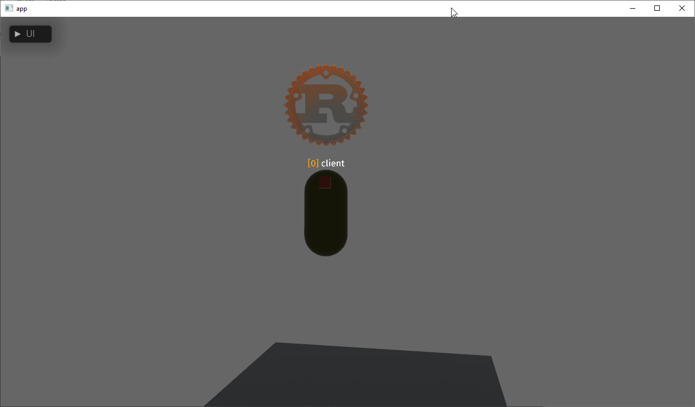

# bevy_mod_billboard
Billboard text and texture support for bevy



## Todo
- Add documentation
- Follow Rust API Guidelines: https://rust-lang.github.io/api-guidelines/about.html
- Batching

## Features
- Styled text with multiple fonts.
- Textures.
- Depth culling enabling/disabling (enabled by default).
- Y-axis locking (disabled by default).
- Full rotation lock for stuff like 3D world-space text (@robftm)
- HDR support (@robtfm)

## Bevy Compatibility

| Bevy Version | Crate Version |
|--------------|---------------|
| `0.14`       | `0.7.0`       |
| `0.13`       | `0.6.0`       |
| `0.12`       | `0.5.1`       |
| `0.11`       | `0.4.1`       |
| `0.10`       | `0.3.0`       |
| `0.10`       | `0.2.1`       |
| `0.9`        | `0.1.1`       |

## Example

Setup:
```rs
use bevy_mod_billboard::prelude::*;

App::new()
    .add_plugins((DefaultPlugins, BillboardPlugin));
```

Text:
```rs
commands
    .spawn((
        BillboardText::default(),
        TextLayout::new_with_justify(Justify::Center),
        Transform::from_scale(Vec3::splat(0.0085)),
    ))
    .with_child((
        TextSpan::new("IMPORTANT"),
        TextFont::from(fira_sans_regular_handle.clone()).with_font_size(60.0),
        TextColor::from(Color::Srgba(palettes::css::ORANGE)),
    ))
    .with_child((
        TextSpan::new(" text"),
        TextFont::from(fira_sans_regular_handle.clone()).with_font_size(60.0),
        TextColor::from(Color::WHITE),
    ));
```

Texture:
```rs
commands.spawn((
    BillboardTexture(image_handle.clone()),
    BillboardMesh(meshes.add(Rectangle::from_size(Vec2::splat(2.0)))),
    Transform::from_xyz(0.0, 5.0, 0.0),
));
```

Full examples at [examples](examples).

## Changelog

### [0.7.0] - 2024-07-11
- Upgrade to Bevy 0.14 (@interwhy).
- Add Billboard marker component.

### [0.6.0] - 2024-06-09
- Upgrade to Bevy 0.13 (@RobWalt).
- Enable bevy's wayland & X11 features.

### [0.5.1] - 2023-12-05
- Fix billboard propagation not working.

### [0.5.0] - 2023-12-04
- Upgrade to Bevy 0.12 (@robftm).
- Remove texture array implementation.
- Use 1:N game world -> render world mapping.
- Remove asset type BillboardTexture.
- Add BillboardTextureHandle wrapper.
- Reduce memory usage.
- Increase performance for most used text case.
- Add stress_test example (@alice-i-cecile).
- Add rotating camera to most of the examples to showcase better.

## License

Licensed under either of

* Apache License, Version 2.0
([LICENSE-APACHE](LICENSE-APACHE) or http://www.apache.org/licenses/LICENSE-2.0)
* MIT license
([LICENSE-MIT](LICENSE-MIT) or http://opensource.org/licenses/MIT)

at your option.

## Contribution
Unless you explicitly state otherwise, any contribution intentionally submitted for inclusion in the work by you, as defined in the Apache-2.0 license, shall be dual licensed as above, without any additional terms or conditions.
